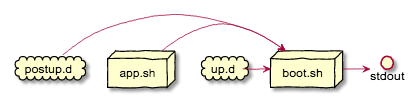

# DockerBootstrap

Booting Dockercontainer and make any things before Service start or make thins after Service is started. It's up to you!



### Installation

```
git clone https://github.com/dockermgeo/DockerBootstrap.git
cd DockerBootstrap
make
```

After installing Dockerbootstrap you'll find this structure:

```
/boot.sh
/app.sh (your appfile)
/etc/docker/modules/
/etc/docker/up.d/
/etc/docker/postup.d/
```
* **/app** Startscript of your app
* **/boot** Mainscript calling /etc/docker/modules/init
* **modules** include default initscript and other functions
* **up.d** place where each Shellscript will startet
* **postup.d** place where each Shellscript will startet after MAIN-APP started
